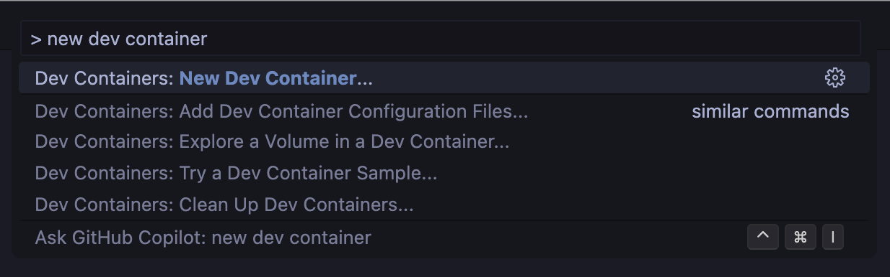

# devcontainer-templates

Dev container template demos. 📚 Learn more from

- [devcontainers/templates](https://github.com/devcontainers/templates)
- [devcontainers/template-starter](https://github.com/devcontainers/template-starter)

## Guide

1. Maintain templates in the [templates](https://github.com/demos-by-igwejk/devcontainer-templates/tree/main/templates) directory
1. automatic on push[Publish](https://github.com/demos-by-igwejk/decontainer-templates/tree/main/.github/workflows/release.yaml) the template to ghcr.io
1. Create a [pull request](https://github.com/devcontainers/devcontainers.github.io/pull/446) to list the template for discovery by VS Code
1. Use the template to create a new dev container on Codespaces or VS Code

   
